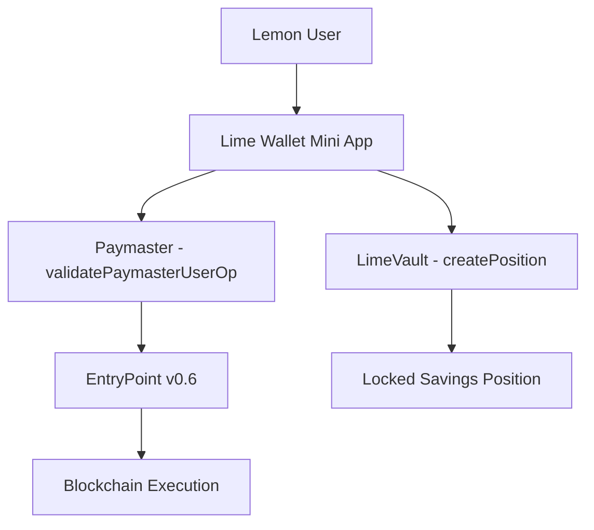

# Architecture

## On-chain
- LimeVault
- LimePaymaster (ERC-4337, USDC, oráculo)

## Off-chain
- Mini App Lime Wallet
- Backend policy/pricing

## Flow (Mermaid)

```mermaid
flowchart TD
    A[Lemon User] --> B[Lime Wallet Mini App]
    B --> C[LimeVault - createPosition]
    B --> D[Paymaster - validatePaymasterUserOp]
    D --> E[EntryPoint v0.6]
    E --> F[Blockchain Execution]
    C --> G[Locked Savings Position]
```
